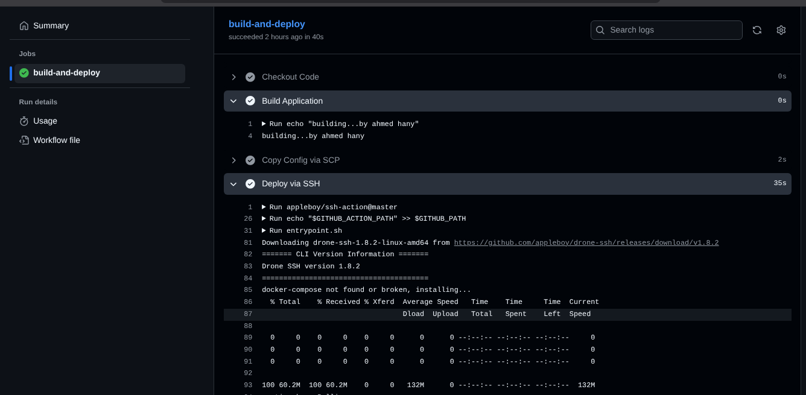
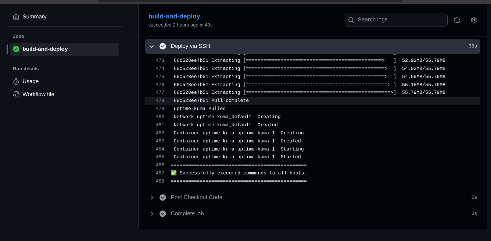
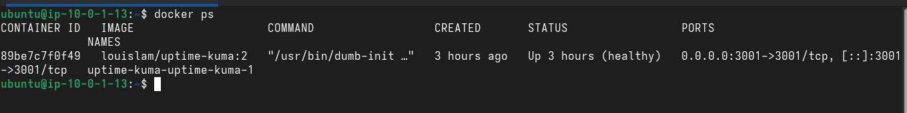
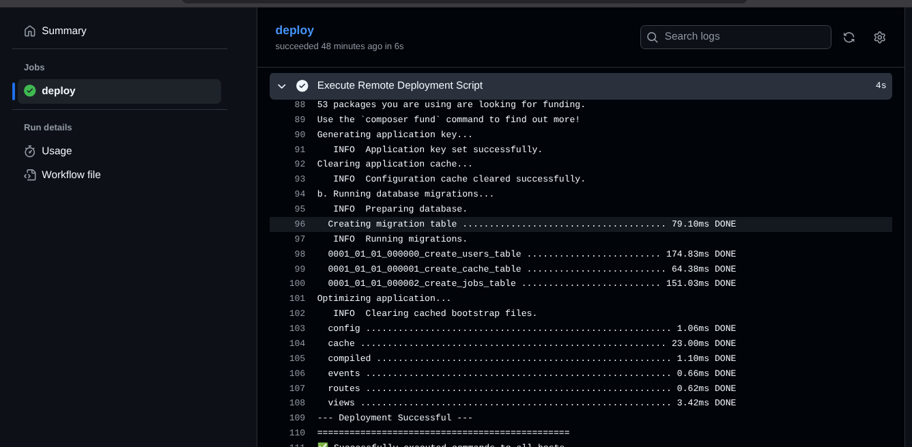
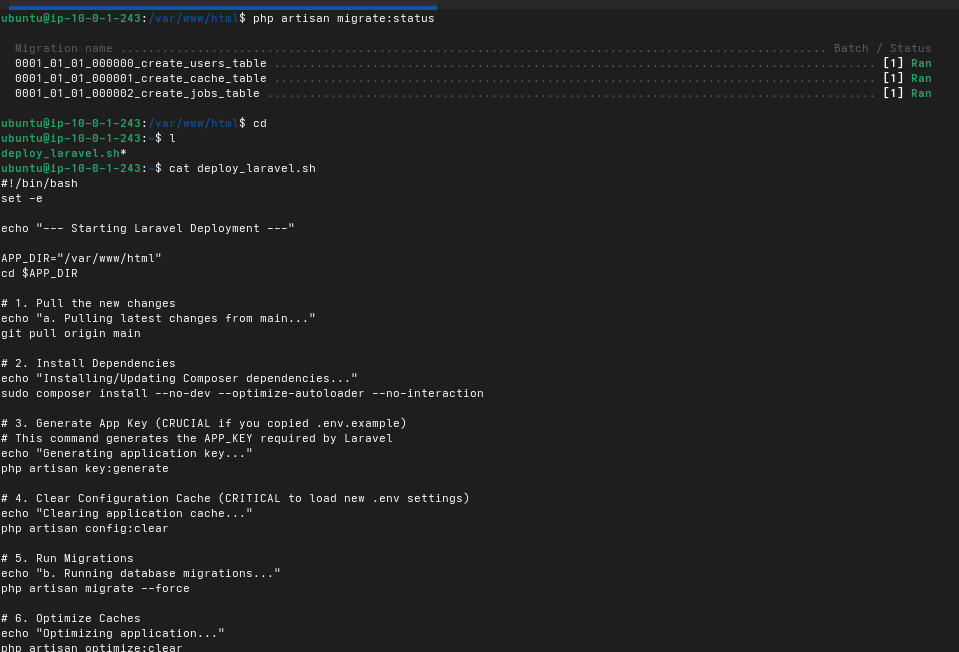

# Obelion Cloud Automation Assessment

This repository contains the assessment tasks for the Obelion Cloud Automation role.

## TaskGroup A

The infrastructure code and documentation for TaskGroup A can be found in the [TaskGroupA](./TaskGroupA) directory.

## TaskGroup B

This section details the repositories and evidence for TaskGroup B.

### Project Structure

```
Task-GroupB/
├── Task-GroupB1/      # Uptime Kuma Deployment
└── Task-GroupB2/      # Laravel Application Deployment
```

### TaskGroup B1: Uptime Kuma

*   **Repository:** [https://github.com/Ahmedheggy/uptime-kuma.git](https://github.com/Ahmedheggy/uptime-kuma.git)

#### Screenshots







### TaskGroup B2: Laravel Application

*   **Repository:** [https://github.com/Ahmedheggy/laravel.git](https://github.com/Ahmedheggy/laravel.git)

#### Screenshots




